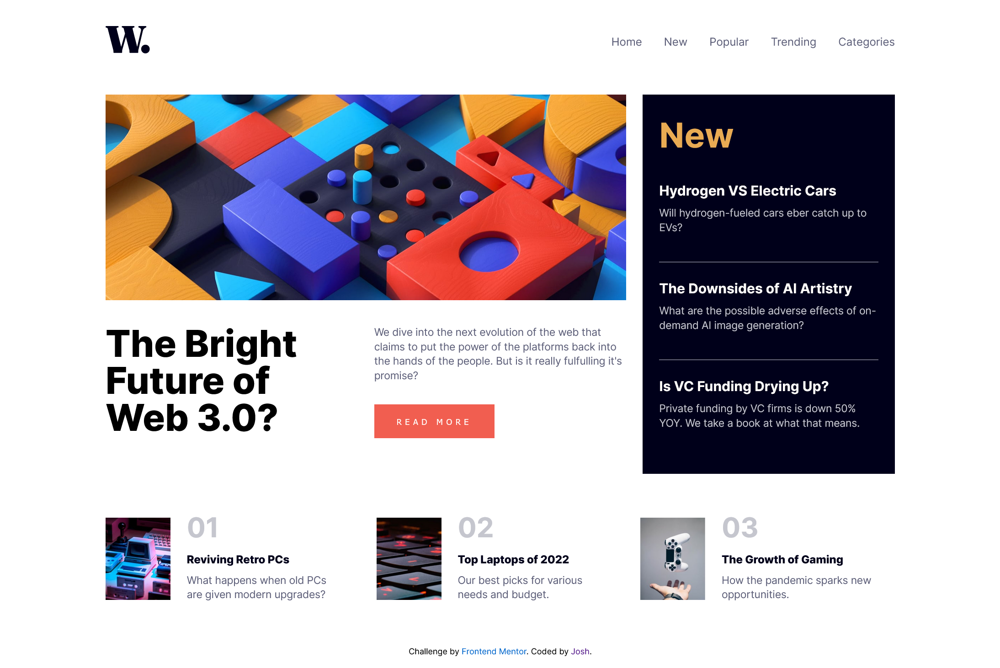

# Frontend Mentor - News homepage solution

This is a solution to the [News homepage challenge on Frontend Mentor](https://www.frontendmentor.io/challenges/news-homepage-H6SWTa1MFl). Frontend Mentor challenges help you improve your coding skills by building realistic projects.

## Table of contents

-   [Overview](#overview)
    -   [The challenge](#the-challenge)
    -   [Screenshot](#screenshot)
    -   [Links](#links)
-   [My process](#my-process)
    -   [Built with](#built-with)
    -   [What I learned](#what-i-learned)
    -   [Continued development](#continued-development)
    -   [Useful resources](#useful-resources)
-   [Author](#author)
-   [Acknowledgments](#acknowledgments)

**Note: Delete this note and update the table of contents based on what sections you keep.**

## Overview

### The challenge

Users should be able to:

-   View the optimal layout for the interface depending on their device's screen size
-   See hover and focus states for all interactive elements on the page
-   **Bonus**: Toggle the mobile menu (requires some JavaScript)

### Screenshot




### Links

-   Solution URL: https://github.com/Ao-chi/news-homepage-main.git
-   Live Site URL: https://news-homepage12345.netlify.app/

## My process

### Built with

-   Semantic HTML5 markup
-   CSS preprocessor SCSS
-   Flexbox
-   CSS Grid
-   Responsive Design
-   A little bit of Javascript

### What I learned

````scss
@mixin breakpoint($breakpoint: md, $key: min, $orientation: false) {
    @if ($orientation) {
        @media (#{$key}-width: map-get($breakpoints, $breakpoint)) {
            @content;
        }
    } @else {
        @media (#{$key}-width: map-get($breakpoints, $breakpoint)) {
            @content;
        }
    }
}
```js
let nav = document.querySelector(".menu-items");
let overlay = document.querySelector(".overlay");
let iconMenu = document.querySelector(".icon-menu");
let iconClose = document.querySelector(".icon-close");

let toggleFunciton = () => {
    iconMenu.addEventListener("click", () => {
        nav.classList.toggle("active");
        overlay.classList.toggle("active");

        if (iconClose.classList.contains("clicked")) {
            iconClose.classList.remove("clicked");
        } else {
            iconClose.classList.add("clicked");
            iconMenu.classList.add("hide");
        }
    });

    iconClose.addEventListener("click", () => {
        nav.classList.toggle("active");
        overlay.classList.toggle("active");

        if (iconClose.classList.contains("clicked")) {
            iconClose.classList.remove("clicked");
            iconMenu.classList.remove("hide");
        } else {
            iconClose.classList.add("clicked");
            iconMenu.classList.remove("hide");
        }
    });
};

toggleFunciton();
````

I find it challengeing to toggle the close and open icon of the mobile view of nav. Although for most people it's kinda easy but for me it's achallenging one.

### Continued development

I want to focus more on exploring scss and use more javascript if needed in the future challenges that I will try. For now I will try to learn how to structure my scss files in a standard way like most developer do.

### Useful resources

-   (https://css-tricks.com/snippets/css/complete-guide-grid/) - This helped me learning how to use use CSS Grid in this challenge.
-   (https://www.youtube.com/watch?v=YNB-JD7iPoQ) - Also this one, his tutorials are a great help on using CSS grids. Especially setting the layouts using grid-templete-areas.
-   (https://youtu.be/i_23KUAEtUM) - This youtube tutorial helps me with with the basics of git like initializing my repository up to publishing.

## Author

-   Frontend Mentor - [@Ao-chi](https://www.frontendmentor.io/profile/)

## Acknowledgments

I would like to thank the vast resources online that helped me building this project. This includes youtube tutorials, some documentation and a readings from forums on stackoverflow and the like. Y'all people are the best!
